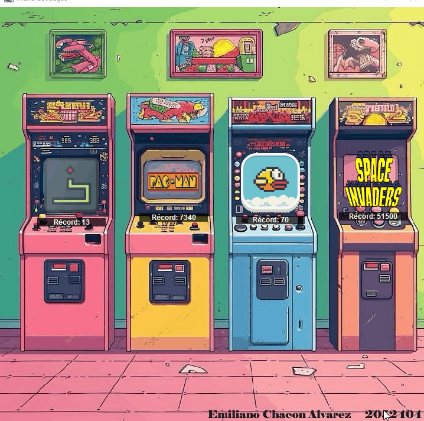
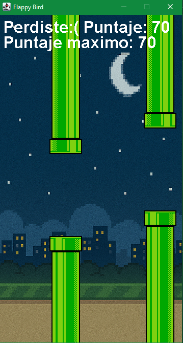

# 🕹️ Java Retro Arcade

Un ecosistema de juegos clásicos desarrollado íntegramente en **Java**, utilizando las librerías **Swing** y **AWT** para la interfaz gráfica y renderizado. Este proyecto demuestra la implementación de lógica de juegos, manejo de estados, persistencia de datos y sistemas de audio.


## Características Globales
* **Selector de Juegos:** Interfaz centralizada para navegar entre los 4 títulos disponibles.
* **Sistema de High Scores:** Guardado local de puntajes máximos para fomentar la competitividad.
* **Experiencia Inmersiva:** Música de fondo variada y efectos de sonido (SFX) originales para cada título.
* **Arquitectura:** Uso de programación orientada a objetos (POO) para la gestión de entidades y colisiones.

---

##  Los Juegos

### 1. Snake 
La versión clásica de la serpiente, pero con mecánicas de riesgo-recompensa.
* **Mecánica Especial:** Aparición de **comida morada** que incrementa permanentemente la velocidad de la serpiente, desafiando los reflejos del jugador.
* **Lógica:** Gestión dinámica de arreglos para el cuerpo y detección de colisiones por coordenadas.


### 2. Pac-man 
Un prototipo funcional centrado en las mecánicas centrales del icónico juego de laberintos.
* **Funcionalidades:** Sistema de vidas, recolección de puntos y la mecánica de "Power Pellets" para comer a los fantasmas.
* **Estado actual:** Implementación de mecánicas de jugador y mapa (IA de fantasmas en desarrollo).



### 3. Flappy Bird (Progressive Difficulty)
Un clon del popular juego móvil con un sistema de progresión visual y técnica.
* **Dificultad Progresiva:** La velocidad del juego aumenta cada 30 puntos.
* **Ciclo de Día/Noche:** El fondo cambia dinámicamente cada 50 puntos para representar el avance del tiempo.




### 4. Space Invaders (Power-up Edition)
Un shooter espacial donde la agilidad es clave debido a la ausencia de barreras protectoras.
* **Sistema de Power-ups:** Estrellas especiales que otorgan:
    * **Doble Disparo:** Aumenta el área de ataque.
    * **Escudo:** Protección temporal contra proyectiles enemigos.
    * **Velocidad de Fuego:** Reduce el cooldown entre disparos.


---

## Tecnologías Utilizadas
* **Lenguaje:** Java 8+
* **Gráficos:** Java Swing & AWT (Canvas, Graphics2D)
* **Audio:** Java Sound API (`javax.sound.sampled`)
* **Persistencia:** Manejo de archivos de texto/binarios para el guardado de récords.

## Instalación y Ejecución
1. Clona el repositorio:
   ```bash
   git clone [https://github.com/tu_usuario/nombre-del-repo.git](https://github.com/tu_usuario/nombre-del-repo.git)
